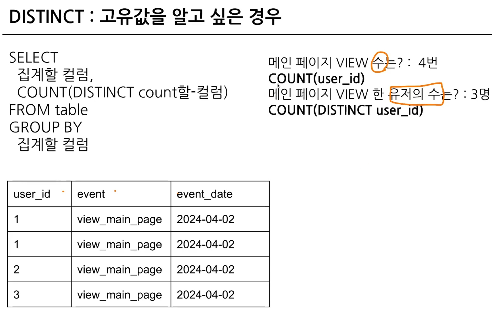
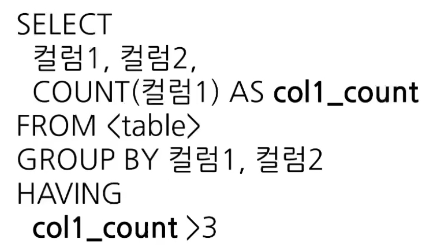
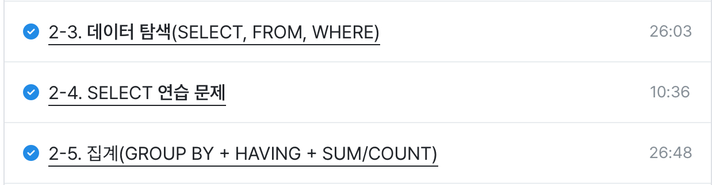

# 데이터 탐색(SELECT, FROM, WHERE)
```SQL
SELECT 
    컬럼1 AS 별칭,
    컬럼2,
    컬럼3
FROM 테이블
WHERE
    조건문
```

FROM: 어떤 테이블에서 데이터를 확인할 것인가?

WHERE: 원하는 조건이 있다면 어떤 조건인가?

SELECT: 테이블의 어떤 컬럼을 선택할 것인가?

AS: 별칭, 컬럼 이름을 바꾸겠다, ""없이!!

```SQL
SELECT
    *
FROM 'bigquery1-435802.basic.pokemon'
WHERE
    type1="Fire"

#<프로젝트 id>.<데이터셋>.<테이블>
#프로젝트 id는 꼭 명시할 필요 없음(프로젝트가 단일이라면)
#프로젝트를 여러개 사용한다면 명시하는 게 좋음
#프로젝트 명시하지 않고 사용하면 ''없어도 됨
```

*: 모든 컬럼을 출력

대신 행이 많으면 빅쿼리에서는 비용이 나가니까 비추 -> 미리보기 사용 

*EXCEPT(제외할 컬럼) 형태도 가능, join에서 유용


테이블 세부정보 최종수정시간: 동기화 시간

; : 하나의 쿼리가 끝남을 표시

엔진의 실행 순서: FROM -> WHERE -> SELECT

### 연습문제
```SQL
SELECT
  hp,
  attack
FROM 'bigquery1-435802.basic.pokemon'
WHERE
  kor_name="피카츄"
```

# 데이터 집계(GROUP BY + HAVING + SUM/ COUNT)
데이터를 요약하는 과정에서 사용

집계: 모아서 계산(그룹화해서 계산)

GROUP BY: 같은 값끼리 모아서 그룹화

특정 컬럼을 기준으로 모으면서 다른 컬럼에선 집계 가능(합, 평균, max, min 등)


정렬: ORDER BY

그룹화한 값에 조건 설정하기(집계 후): HAVING

```SQL
SELECT
    집계할 컬럼1,
    집계 함수(COUNT,MAX,MIN 등)
FROM Table
GROUP BY
    집계할_컬럼1
```

```SQL
#타입을 기준으로 그룹화해서 평균 공격력 집계

#타입을 기준으로 그룹화해서 타입 별 포켓몬 수 집계

SELECT
    type1,
    AVG(attack) AS avg_attack,
    COUNT(id) AS cnt
FROM 'bigquery1-435802.basic.pokemon'
GROUP BY
    type1
```

DISTINCT: 여러 값 중에 고유값을 알고 싶은 경우, 중복을 제거하는 것 -> COUNT(DISTINCT 컬럼)



## 조건 설정
WHERE: 테이블에 바로 조건을 설정하고 싶은 경우, 테이블 데이터에서 조건 설정

HAVING: GROUP BY한 후 조건을 설정하고 싶은 경우



## 정렬하기(ORDER BY)

```SQL
SELCET
    col
FROM
ORDER BY <컬럼> <DESC/OSC(default)>
#쿼리의 맨 마지막에 작성하면 됨
```

## 출력 개수 제한(LIMIT)
LIMIT: 쿼리의 제일 마지막에 작성


```SQL
#포켓몬의 수를 타입별로 집계하고, 포켓몬의 수가 10 이상인 타입만 남기는 쿼리, 포켓몬의 수가 많은 순으로 정렬
SELECT
    type1,
    COUNT(id) AS cnt
FROM 'bigquery1-435802.basic.pokemon'
GROUP BY
    type1
HAVING cnt >= 10
ORDER BY cnt DESC
```

수강 인증
