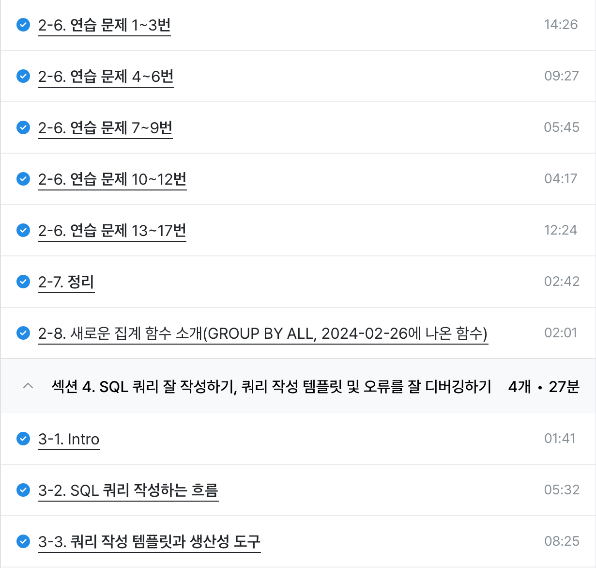

# 데이터 탐색 연습문제
[연습문제 정리](https://github.com/osm1315/SQL/blob/main/데이터%20탐색%20연습문제.md)

# SQL 작성하는 흐름

1. 지표 고민(문제 정의): 어떤 문제를 해결하기 위해 데이터가 필요한가

2. 지표 구체화(지표 정의): 구체적인 지표 명시(분자, 분모 정의 이름 구체적으로)

3. 지표 탐색 -> 해당 쿼리 리뷰 또는 구글 검색

4. 쿼리 작성: 테이블 찾기, ERD, 2개 이상이라면 연결방법 고민

5. 데이터 정합성 확인: 예상한 결과와 동일한지 확인

6. 쿼리 가독성: 깔끔하게 작성 

7. 쿼리 저장: 재사용되므로 문서로 저장

# 쿼리 작성 템플릿과 생산성 도구

템플릿을 쉽게 사용

[Espanso 링크](https://espanso.org)

특정 단어를 입력하면 원하는 문장(템플릿)으로 변경 가능

특정 단어가 감지되면 정의된 것으로 바꿔줌

수강 인증

