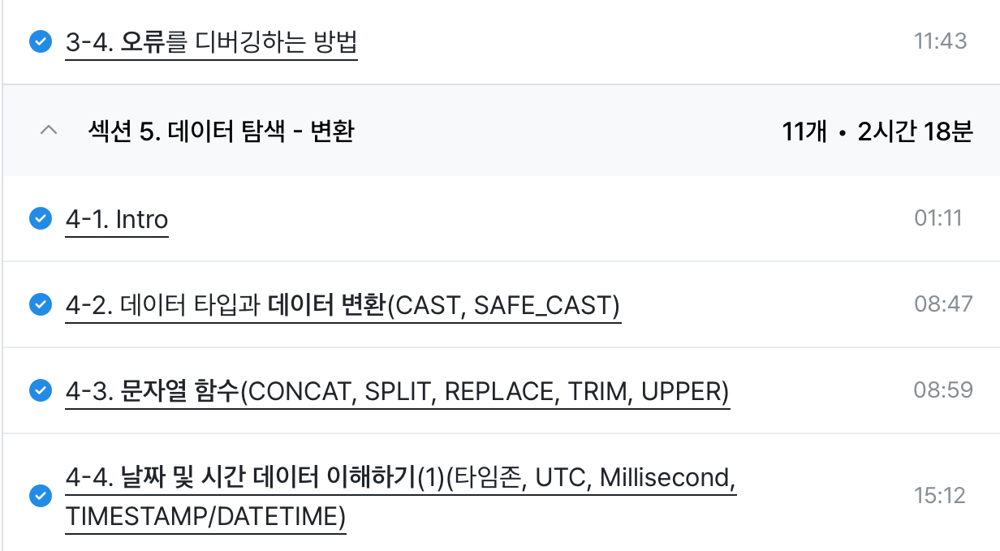

# 데이터 변환(CAST, SAFE_CAST)
데이터 타입은 보이는 것과 저장된 것의 차이가 존재

-> 데이터의 타입을 변경해야함


## CAST
자료 타입 변경
```SQL
SELECT
    CAST(1 AS STRING)
    #숫자 1을 문자 1로 변경
```

## SAFE_CAST
안전하게 데이터 타입 변경

변환이 실패할 경우 NULL반환(오류대신)

+수학함수

나누기를 할 경우 SAFE_DIVIDE함수(SAFE_DIVIDE(x,y)) 사용

x,y 중 하나라도 0인 경우 그냥 나누면 오류 발생

# 문자열 함수(CONCAT, SPLIT, REPLACE, TRIM, UPPER)

문자열 붙이기 -> CONCAT(여러 문자열을 하나로)

문자열 분리하기 -> SPLIT (띄어쓰기 주의, 배열로 출력)


특정 단어 수정하기 -> REPLACE

문자열 자르기 -> TRIM

영어 소문자를 대문자로 변경 -> UPPER


# 날짜 및 시간 데이터 이해하기
대부분의 회사 데이터에는 시간이 명시됨

- created_at
- updated_at

우리가 아는 시간과 개발할때 사용하는 시간은 다름

timezone 존재

## 타입 파악
### DATE
날짜만 표시

### DATETIME
시간까지 표시, Time Zone 정보 없음

### TIME
날짜와 무관하게 시간만 표시

### Time Zone
GMT: 영국의 그리니치 턴문대를 기준으로 지역에 따른 시간의 차이를 조정하기 위해 생긴 시간의 구분선(한국: GMT+9)

UTC: 국제적인 표준 시간, 타임존이 존재한다 = 특정 지역의 표준 시간대(한국: UTC+9)

TIMESTAMP: UTC로부터 경과한 시간을 나타내는 값, 타임존 정보 있음

%20입문%20%20학습%20페이지.jpeg)


### Millisecond(ms)
천분의 1초

빠른 반응이 필요한 분야에서 사용

Millisecond -> TIMESTAMP -> DATETIME 으로 변경해서 사용

+microsecon도 있음(ms에 000붙이기)

변환함수: TIMESTAMP_MILLIS, TIMESTAMP_MICROS

!!DATETIME으로 변환할때 타임존 누락하지 않기(Asia/Seoul)!!

수강 인증

