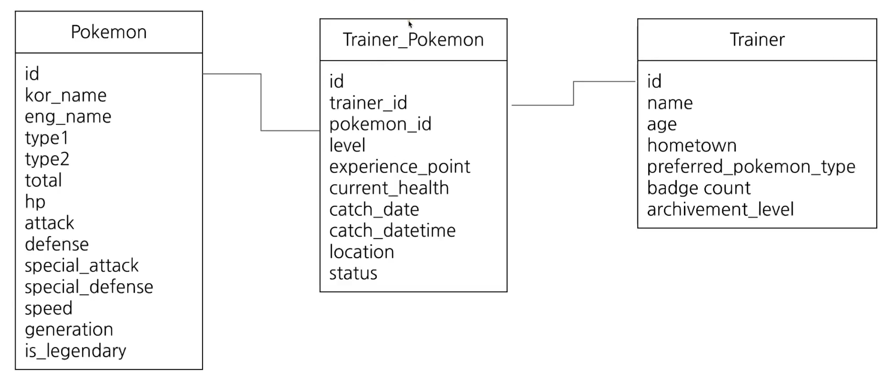

# 데이터 활용 과정 Overview

문제 정의 -> 데이터 탐색 -> 다량의 자료라면 연결 -> 데이터 조건(필터링), 추출, 변환, 요약(집계) 과정 수행 -> 반복 -> !데이터 결과 검증! -> 피드백/활용

SQL에서는 데이터 탐색 ~ 결과 검증까지 진행

# 저장된 데이터 확인

쿼리 작성하기 전 데이터가 어떻게 저장되어 있는지, 어떤 데이터가 저장되어 있는지, 컬럼은 무슨 의미가 있는지 이해 필수

데이터 웨어하우스: 데이터 창고, 안에 테이블이 있음, 데이터를 추출하기 전에 데이터 웨어하우스에 데이터가 어떻게 저장되어 있는지 확인

데이터 저장 형태를 알기 위해서 ERD(entity relationship diagram) 사용 또는 직접 탐색

## 포켓몬 데이터 ERD

